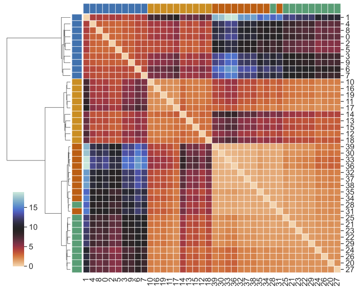

# HyperCOT: Hypergraph Co-Optimal Transport

This repository contains code related to the paper `Hypergraph Co-Optimal Transport: Metric and Categorical Properties` by Samir Chowdhury, Tom Needham, Ethan Semrad, Bei Wang, and Youjia Zhou.

To get started, we suggest creating a new conda environment. From the terminal window, type in:

```
conda create -n HyperCOT python=3.9
conda activate HyperCOT
```

Next, please install the dependencies from the provided `requirements.txt` file.

```
pip install -r requirements.txt
```

The main dependencies for our package are:
- Python Optimal Transport (https://pythonot.github.io/)
- HyperNetX (https://github.com/pnnl/HyperNetX)


Additionally, we utilize code from:
- Redko, Vayer, Flamary, Courty (2020), _CO-Optimal Transport_
    - https://github.com/PythonOT/COOT
- Zhou, Rathore, Purvine, Wang (2021), _Topological Simplifications of Hypergraphs_
    - https://github.com/tdavislab/Hypergraph-Vis
- Do, Yoon, Hooi, Shin (2020), _Structural Patterns and Generative Models of Real-world Hypergraphs_
    - https://github.com/manhtuando97/KDD-20-Hypergraph
    
    
### Included in this repo:

- code to compute HyperCOT distances
- demo notebook to generate hypergraphs from meshes and perform simple color transfer (requires `plotly`) as below:


    
### Getting started 

- Try running the `run_simulated.ipynb` notebook. Here we load a dataset of 40 simulated hypergraphs and show how to compute HyperCOT distances for a pair of hypergraphs. Although we do not go through the full computation in the notebook, computing all the pairwise distances should yield a matrix as follows (plotted using `seaborn`):


