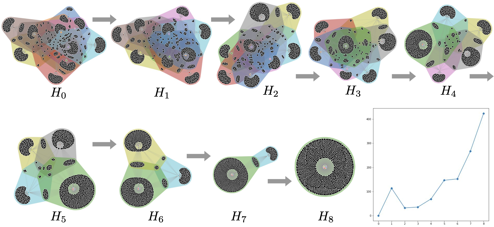

## HyperCOT: Hypergraph Co-Optimal Transport

This repository contains code related to the paper `Hypergraph Co-Optimal Transport: Metric and Categorical Properties` by Samir Chowdhury, Tom Needham, Ethan Semrad, Bei Wang, and Youjia Zhou.

To get started, we suggest creating a new conda environment. From the terminal window, type in:

```
conda create -n HyperCOT python=3.9
conda activate HyperCOT
```

Next, please install the dependencies from the provided `requirements.txt` file.

```
pip install -r requirements.txt
```

The main dependencies for our package are:
- Python Optimal Transport (https://pythonot.github.io/)
- HyperNetX (https://github.com/pnnl/HyperNetX)
